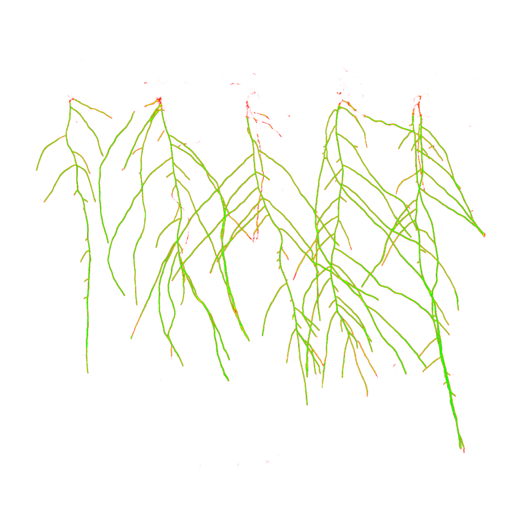

# ATHENA

## Description

ATHENA is a Python package in development and cloud application designed for plant science researchers at the Netherlands Plant Eco-phenotyping Centre (NPEC). This powerful tool enables precise organ segmentation and landmark detection on high-resolution plant images, facilitating a deeper understanding of plant phenotypes and environmental effects. ATHENA allows research centers to train models or use pre-trained models on their own data and provides a high level of customisability, ensuring precise analysis on various use cases within plant phenotyping. 

This application is deployed as an advanced tool built on NPEC's phenotyping installations designed for high-throughput phenotyping. NPEC's systems, called 'Helios' & 'Hades', capture high-quality data from plants above and below ground. Named after the Greek goddess of wisdom, ATHENA embodies (artificial) intelligence and strategic warfare, metaphors that align well with the application's goal to harness sophisticated analytical capabilities in plant science. Automating the labeling and analysis process, this application allows easy tracking of strategically modified environmental circumstances.

## Features
### Early Access Features

Athena provides several key features to assist researchers in plant phenotyping:

1. **User Interface**: A user friendly interface that allows dataset management, model training, model management, viewing predictions using a custom API.
2. **Standardised Data Pre-processing**: Processes data that is compatible with the model architectures.
3. **Command Line Interface**: Interact with the package with 1 line of code. This package provides high customisability options as well as a default option to run a pipeline.
4. **Upload Own Data**: Provide new or different data to train models on.
5. **Choose Model Complexity**: Choose between the MODEL1 and MODEL2 architectures, or use our pre-trained model for faster results.
6. **Automated Hyperparameter Tuning**: Provides an option to automate certain hyperparameters in model training.
7. **High Coverage of Unit Tests**: Modify the code and use unit-tests to debug problems.
8. **Locally or in the Cloud**: No GPU? No problem! Train your models locally or in the cloud (currently limited to CLI only).

### Features in Development

1. **Model Training Status**: View the status of your training jobs in the user interface.
1. **Model Training Status**: View the status of your training jobs in the user interface.
1. **Root Landmark Prediction**: Accurately predicts root landmarks on high-resolution plant images.
2. **Root Measurement**: Offers tools to measure various root attributes precisely.
3. **Shoot Surface Area Calculation**: Calculates the shoot surface area.

## Folder Structure

Here's an overview of the folder structure in the Athena project:
<pre>
├── data/
│   ├── raw/
|   │   └── [DATASET]/
|   |            ├── images/
|   │            └── masks/
│   ├── processed/
|   │   └── [DATASET]/
|   |            ├── train_images/
|   │            └── train_masks/
│   └── predictions/
|   │   └── [DATASET]_[MODEL]/
|   |            ├── image/
|   |            ├── combined_mask/
|   |            ├── probability_map/
|   |            ├── individual_masks/
|   │            └── checked/
|   |               ├── model_correct/
|   |               ├── model_incorrect/
|   │               └── user_upload_correct/
├── docs/
│   ├── documentation/
|   └── coverage/
├── models/
├── src/
│   ├── init.py
│   ├── pycache/
│   ├── data/
│   │   ├── init.py
│   │   ├── pycache/
│   │   ├── data_preprocessing.py
│   │   ├── data_validation.py
│   │   ├── data_ingestion.py
│   │   ├── image_data_gen.py
│   │   ├── logger_datagen.py
│   │   ├── logger.py
│   ├── inference/
│   │   ├── init.py
│   │   ├── inference.py
│   │   ├── visualization.py
│   │   ├── processing.py
│   │   ├── landmark_detection.py
│   ├── models/
│   │   ├── init.py
│   │   ├── model_definitions.py
│   │   ├── model_training.py
│   │   ├── model_evaluation.py
│   │   ├── model_tuning.py
│   │   ├── model_saving.py
│   │   ├── model.py
│   ├── utils/
│   │   ├── init.py
│   │   └── helpers.py
├── tests/
├── .gitignore
├── LICENSE
├── README.md
└── pyproject.toml
</pre>

## Installation Guidance

### Prerequisites

Make sure you have Python 3.10.11 installed on your machine. You can download it from [python.org](https://www.python.org/downloads/release/python-31011/).

### Project Setup

1. **Clone the Repository**

   First, clone this repository to your local machine using:
   ```bash
   git clone [repository URL]
   ```

2. **Install Poetry**

   This project uses Poetry for dependency management. If you don't have Poetry installed, you can install it by following the instructions on the [official Poetry website](https://python-poetry.org/docs/#installation). Alternatively, you can simulate an environment using the `requirements.txt` file.

3. **Install Dependencies**

   Navigate to the project directory and install the required dependencies by running:
   ```bash
   poetry install
   ```

### Additional Packages

This project depends on several Python packages listed below:
- **Jupyter**: For interactive computing and data visualization.
- **NumPy**: For numerical operations.
- **OpenCV-Python**: For computer vision tasks.
- **Matplotlib**: For creating static, interactive, and animated visualizations in Python.
- **Patchify, tqdm, scikit-learn**: For image processing, progress bars, and machine learning tasks, respectively.
- **TensorFlow-GPU**: For running deep learning models with GPU support.
- **pre-commit**: To manage and maintain pre-commit hooks.
- **Other dependencies**: `ipykernel`, `tensorflow-io-gcs-filesystem`, `skan`, and a custom `logger`.

### Running Single Python Scripts

To run a specific Python script in the project, use the following commands:

1. **Activate the Poetry Environment**

   Before running any script, you need to activate the Poetry environment:
   ```bash
   poetry shell
   ```

2. **Run the Python Script**

   Once the Poetry environment is activated, you can run your Python scripts directly. For example, if you have a script named `process_data.py` located in the `app/backend` directory, you would run:
   ```bash
   python src/process_data.py --mode custom --store local --dir /path/to/dir/
   ```
   --mode:

#### Command-Line Options

##### `--mode`

- **Description**: Mode of operation.
- **Options**:
  - `custom`: For user-specific processing.
  - `default`: For automatic processing.
- **Example**: `--mode custom`

##### `--store`

- **Description**: Specify the storage mode for the application.
- **Options**:
  - `local`: Use local storage.
  - `cloud`: Use cloud storage.
- **Example**: `--store local`

##### `--dir`
- **Description**: Specify the directory to process. Overrides the default directory selection. No specification will process data to `data/processed`
- **Example**: `--dir /path/to/dir/`
Keep in mind to set the working environment to that directory.

This setup ensures that you can manage dependencies with Poetry while also being able to run individual Python scripts easily.

### Running the ATHENA Package

To run a specific function from the package, you need to first install the package and then run the provided command with the necessary arguments. Below are the detailed steps and descriptions of the command-line options available for your package.

#### Installation

##### Navigate to the Athena Directory

Before installing the package, navigate to the directory where the package is located:
```bash
cd /path/to/athena
```

##### Install the Package

Use `pip` to install the package:
```bash
pip install dist/ATHENA-0.0.1-py3-none-any.whl
```

## Running the Package

Once the package is installed, you can run the package commands directly from the command line. Here is an example command and detailed descriptions of the available arguments.

```bash
athena --train --train_path "my_dataset" --depth 1 --model_name "my_model"
```

## Command-Line Options

### `--train`

- **Description**: Train a new model.
- **Type**: Flag
- **Required**: No

### `--train_path`

- **Description**: Name of the dataset in data/processed.
- **Type**: `str`
- **Required**: Yes (if `--train` is specified)

### `--depth`

- **Description**: Depth of the model. Must be 0 or 1.
- **Type**: `int`
- **Choices**: `[0, 1]`
- **Required**: Yes (if `--train` is specified)

### `--predict_path`

- **Description**: Also name of the dataset in data/processed.
- **Type**: `str`
- **Required**: No

### `--model_name`

- **Description**: Name of the model to save or use for predictions.
- **Type**: `str`
- **Required**: Yes (if `--train` is specified or if `--predict_path` is specified)

This setup ensures that you can manage dependencies and run your package's functionalities efficiently.

## Pipeline breakdown
1. Import data

2. Region Of Interest extraction

3. Padding

4. Patchifying

5. Model selection + hyperparameters
6. Model training
7. Prediction

Classes:


Probability of class:



## Credits
ATHENA was developed by a dedicated team of developers and researchers passionate about advancing plant science through innovative technology. This project is a proud product of the Netherlands Plant Eco-phenotyping Centre (NPEC) and aims to elevate research capabilities in the plant phenotyping community.

### Development Team
**Dániel Elek** - Support 

**Benjamin Graziadei** - Computer Vision Modeller

**Kian van Holst** - Full Stack Developer & DevOps Specialist

**Matey Nedyalkov** - Data Engineer & Cloud Architect

**Dominik Szewczyk** - Technical Analyst & MLOps Specialist

### Acknowledgements
This project would not have been possible without the data provided by NPEC, including their advanced phenotyping installations, 'Helios' and 'Hades'. Special thanks to the NPEC researchers and technical staff, our mentors at the Applied Data Science & Artificial Intelligence programme, Dean van Aswegen and Alican Noyan, who took the time to set up this project and provided essential guidance whenever needed.